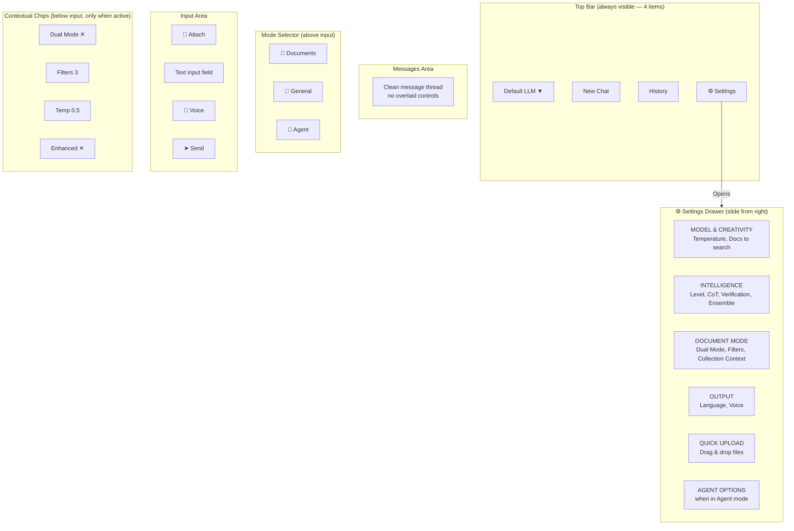
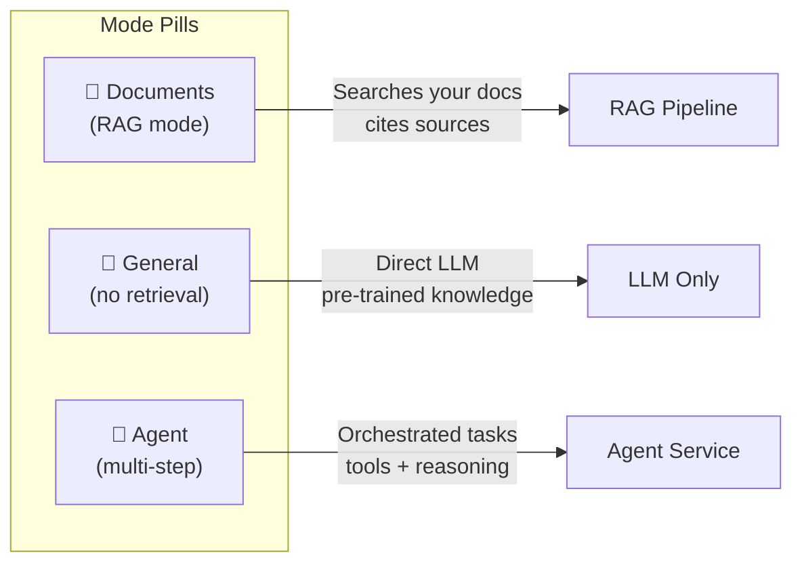

# Chat UI Architecture

## Layout Structure

The chat interface uses a progressive disclosure pattern — only essential controls are visible, with all advanced options accessible via a settings drawer.

## Mode Selector

## Settings Drawer Sections

### Model & Creativity
- **Temperature slider** (0.0 - 2.0) — controls response randomness
- **Documents to search** (Auto / 3-25) — overrides top_k

### Intelligence Level
- **Basic** — fast dense search, no verification
- **Standard** — hybrid search + basic verification
- **Enhanced** — + query expansion, CoT, KG
- **Maximum** — + ensemble voting, extended thinking

Individual toggles:
- Query Enhancement (expansion + HyDE)
- Chain-of-Thought reasoning
- Self-Verification
- Ensemble Voting
- Extended Thinking

### Document Mode
- **Dual Mode** — parallel RAG + general knowledge
- **Filters** — collection, folder, date range
- **No AI Knowledge** — restrict to documents only
- **Collection Context** — include full collection metadata

### Output
- **Language** — auto-detect or force specific language
- **Voice Mode** — text-to-speech for responses

## Contextual Chips

Small dismissible badges appear below the mode pills when advanced features are active:

| Chip | Appears When | Action on Click |
|------|-------------|-----------------|
| `Dual Mode ✕` | Dual mode enabled | Opens settings drawer |
| `Filters (N)` | Active filters count > 0 | Opens filter section |
| `N files attached` | Temp documents uploaded | Shows file list |
| `Voice On` | Voice mode active | Toggle off |
| `Enhanced` | Intelligence > standard | Opens intelligence section |
| `Temp 0.5` | Manual temperature set | Opens model section |

## Keyboard Shortcuts

| Shortcut | Action |
|----------|--------|
| `Cmd+,` / `Ctrl+,` | Toggle settings drawer |
| `Enter` | Send message |
| `Shift+Enter` | New line in input |
