# Chat UI Architecture

## Layout Structure

The chat interface uses a progressive disclosure pattern — only essential controls are visible, with all advanced options accessible via a settings drawer.

```mermaid
flowchart TD
    subgraph "Top Bar (always visible — 4 items)"
        LLM[Default LLM ▼]
        NEW[New Chat]
        HIST[History]
        GEAR[⚙ Settings]
    end

    subgraph "Messages Area"
        MSG[Clean message thread<br/>no overlaid controls]
    end

    subgraph "Mode Selector (above input)"
        DOCS[📄 Documents]
        GEN[🧠 General]
        AGENT[🤖 Agent]
    end

    subgraph "Input Area"
        ATTACH[📎 Attach]
        INPUT[Text input field]
        MIC[🎤 Voice]
        SEND[➤ Send]
    end

    subgraph "Contextual Chips (below input, only when active)"
        DUAL[Dual Mode ✕]
        FILT[Filters 3]
        TEMP[Temp 0.5]
        INTEL[Enhanced ✕]
    end

    GEAR -->|Opens| DRAWER

    subgraph DRAWER["⚙ Settings Drawer (slide from right)"]
        D1[MODEL & CREATIVITY<br/>Temperature, Docs to search]
        D2[INTELLIGENCE<br/>Level, CoT, Verification, Ensemble]
        D3[DOCUMENT MODE<br/>Dual Mode, Filters, Collection Context]
        D4[OUTPUT<br/>Language, Voice]
        D5[QUICK UPLOAD<br/>Drag & drop files]
        D6[AGENT OPTIONS<br/>when in Agent mode]
    end
```

## Mode Selector

```mermaid
flowchart LR
    subgraph "Mode Pills"
        D["📄 Documents<br/>(RAG mode)"]
        G["🧠 General<br/>(no retrieval)"]
        A["🤖 Agent<br/>(multi-step)"]
    end

    D -->|Searches your docs<br/>cites sources| RAG[RAG Pipeline]
    G -->|Direct LLM<br/>pre-trained knowledge| LLM[LLM Only]
    A -->|Orchestrated tasks<br/>tools + reasoning| AGENT_SVC[Agent Service]
```

## Settings Drawer Sections

### Model & Creativity
- **Temperature slider** (0.0 - 2.0) — controls response randomness
- **Documents to search** (Auto / 3-25) — overrides top_k

### Intelligence Level
- **Basic** — fast dense search, no verification
- **Standard** — hybrid search + basic verification
- **Enhanced** — + query expansion, CoT, KG
- **Maximum** — + ensemble voting, extended thinking

Individual toggles:
- Query Enhancement (expansion + HyDE)
- Chain-of-Thought reasoning
- Self-Verification
- Ensemble Voting
- Extended Thinking

### Document Mode
- **Dual Mode** — parallel RAG + general knowledge
- **Filters** — collection, folder, date range
- **No AI Knowledge** — restrict to documents only
- **Collection Context** — include full collection metadata

### Output
- **Language** — auto-detect or force specific language
- **Voice Mode** — text-to-speech for responses

## Contextual Chips

Small dismissible badges appear below the mode pills when advanced features are active:

| Chip | Appears When | Action on Click |
|------|-------------|-----------------|
| `Dual Mode ✕` | Dual mode enabled | Opens settings drawer |
| `Filters (N)` | Active filters count > 0 | Opens filter section |
| `N files attached` | Temp documents uploaded | Shows file list |
| `Voice On` | Voice mode active | Toggle off |
| `Enhanced` | Intelligence > standard | Opens intelligence section |
| `Temp 0.5` | Manual temperature set | Opens model section |

## Keyboard Shortcuts

| Shortcut | Action |
|----------|--------|
| `Cmd+,` / `Ctrl+,` | Toggle settings drawer |
| `Enter` | Send message |
| `Shift+Enter` | New line in input |
