# Connector System

## Overview

Connectors allow syncing documents from external sources (Google Drive, Notion, Confluence, custom servers, etc.) into the document index.


## Storage Modes


### Storage Mode Resolution


## Sync Flow

```mermaid
sequenceDiagram
    participant S as Scheduler
    participant C as Connector (e.g., GDrive)
    participant DB as PostgreSQL
    participant P as Pipeline

    S->>C: list_resources()
    C-->>S: Resource list (name, id, modified_at)

    S->>DB: Check SyncedResource table
    DB-->>S: Last sync timestamps

    loop For each new/modified resource
        S->>C: download_resource(id)
        C-->>S: File content (bytes)

        S->>DB: Check storage mode (per-connector → global)

        alt Download Mode
            S->>S: Save file to storage/documents/uuid/
            S->>DB: Create Document (is_stored_locally=true)
        else Process Only Mode
            S->>S: Save temp file
            S->>DB: Create Document (is_stored_locally=false)
        end

        S->>P: Trigger processing pipeline
        P->>P: Parse → Chunk → Embed → Index

        alt Process Only
            S->>S: Delete temp file from disk
        end

        S->>DB: Create/Update SyncedResource record
    end
```



## Source Metadata

Every document tracks its provenance:

```json
{
  "source_url": "https://drive.google.com/file/d/abc123",
  "source_type": "google_drive",
  "is_stored_locally": false,
  "upload_source_info": {
    "upload_method": "connector_sync",
    "connector_type": "google_drive",
    "connector_name": "Team Drive",
    "external_id": "abc123",
    "external_path": "/Shared/Reports/Q4.pdf",
    "external_url": "https://drive.google.com/file/d/abc123",
    "synced_at": "2024-01-15T10:30:00Z",
    "storage_mode": "process_only"
  }
}
```

## External Document Preview

When a document is stored externally (`is_stored_locally=false`):

```mermaid
flowchart TD
    DOC[External Document] --> CHECK{Source Type?}

    CHECK -->|Google Drive| GDOCS[Google Docs Viewer<br/>iframe embed]
    CHECK -->|Direct PDF URL| IFRAME[Direct iframe<br/>embed attempt]
    CHECK -->|Other| PLACEHOLDER[Placeholder with<br/>summary + Open in Source]

    GDOCS --> WORKS{iframe<br/>loads?}
    IFRAME --> WORKS
    WORKS -->|Yes| PREVIEW[Show embedded preview]
    WORKS -->|No| FALLBACK[Show placeholder<br/>+ error message]

    PLACEHOLDER --> ACTIONS
    FALLBACK --> ACTIONS
    PREVIEW --> ACTIONS

    ACTIONS[User Actions]
    ACTIONS --> OPEN[🔗 Open in Source<br/>opens external URL]
    ACTIONS --> IMPORT[💾 Import Copy<br/>downloads & stores locally]
```



### Import Copy Endpoint

`POST /documents/{doc_id}/import-local`

Downloads the file from `source_url`, saves to local storage, and sets `is_stored_locally=true`. After import, the standard local preview takes over.

## Admin Settings

### Global Storage Settings (Admin > Settings > Ingestion)

| Setting | Options | Description |
|---------|---------|-------------|
| Default Storage Mode | Download / Process Only | How new connector syncs store files |
| Store Source Metadata | On / Off | Track upload provenance |

### Per-Connector Override (Connector Settings)

| Option | Description |
|--------|-------------|
| Use Global Default | Follow the global setting |
| Download & Store | Always store files locally |
| Process Only | Never store files, keep links |

### Storage Stats (Admin > Settings > Ingestion)

Shows breakdown of:
- Local vs external document counts
- Storage size by category
- Per-source-type breakdown (e.g., google_drive: 22 docs, 450 MB, 12 external)
