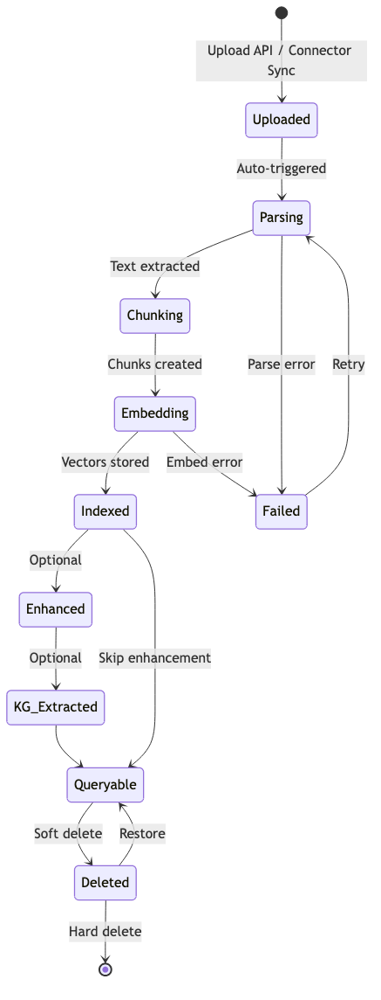
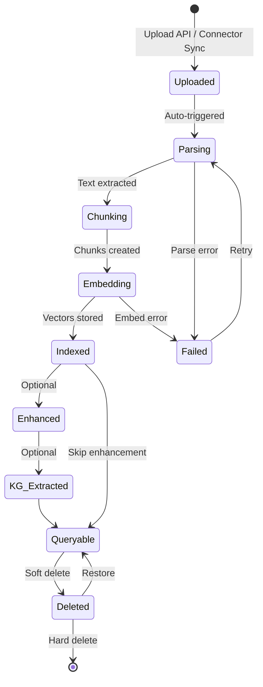
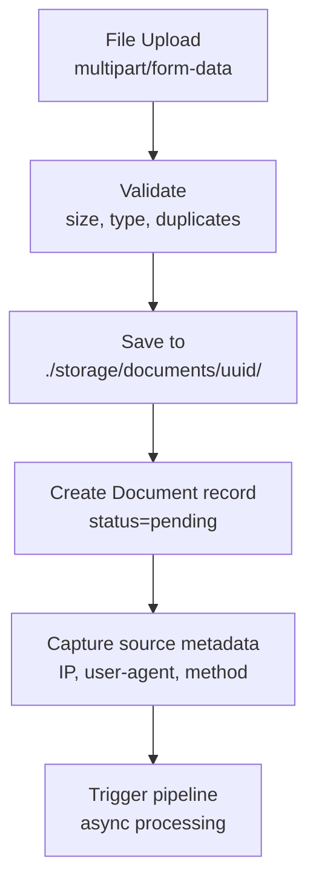
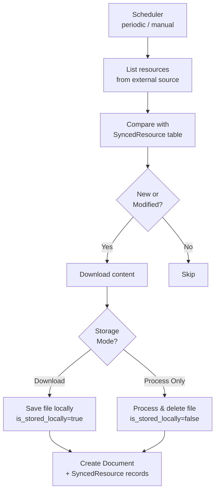
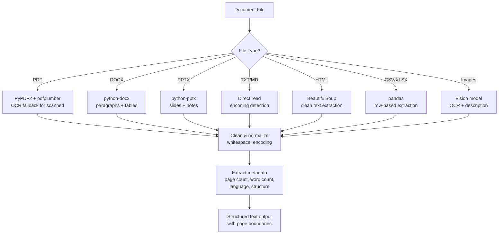
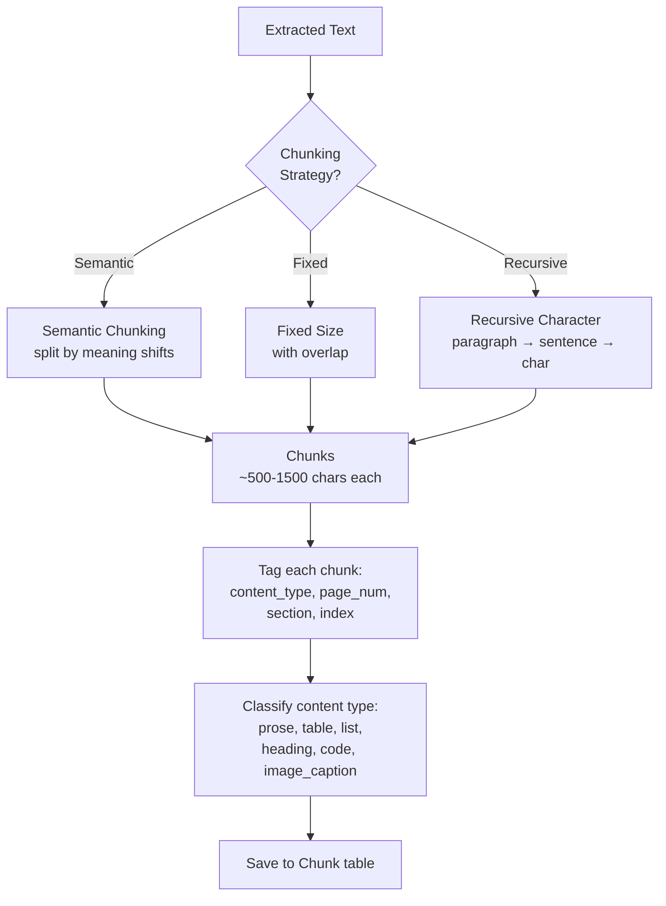
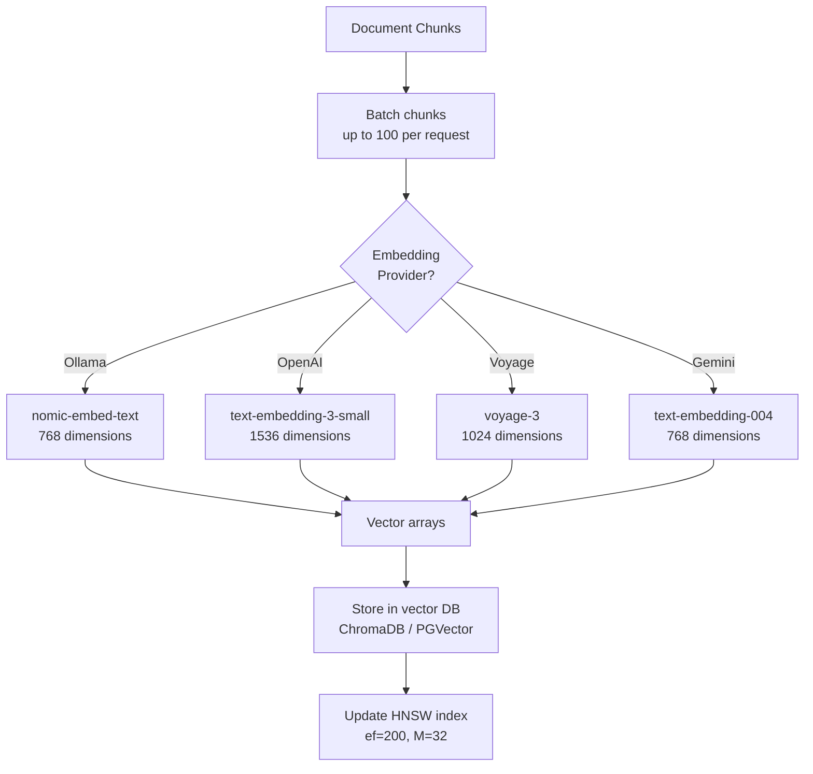
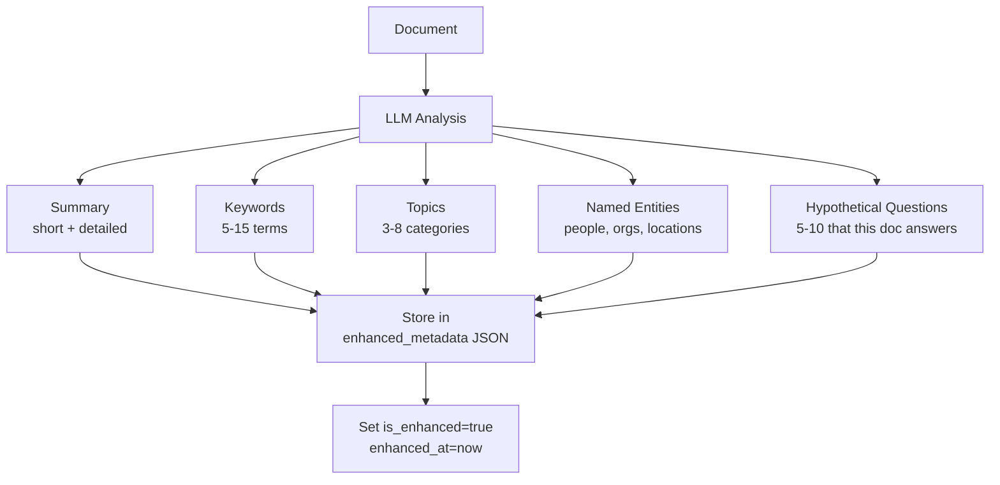
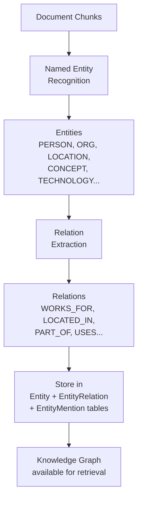
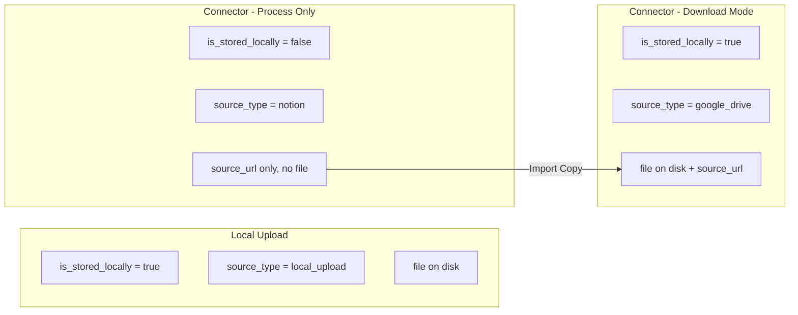

# Document Lifecycle



## Overview

Documents go through a multi-stage lifecycle from upload to queryable state.



## Stage 1: Upload / Ingest

### Local Upload

**File:** `backend/api/routes/documents.py` — POST `/documents`



Source metadata captured:
```json
{
  "upload_method": "web_upload",
  "uploaded_by": "user-uuid",
  "uploaded_at": "2024-01-15T10:30:00Z",
  "client_ip": "192.168.1.100",
  "user_agent": "Mozilla/5.0...",
  "original_filename": "report.pdf"
}
```

### Connector Sync

**File:** `backend/services/connectors/scheduler.py`



Storage mode can be set:
1. **Global default:** Admin > Settings > Ingestion > Default Storage Mode
2. **Per-connector override:** Connector settings > Storage Mode
3. **Priority:** Per-connector > Global > "download" (default)

## Stage 2: Document Parsing

**File:** `backend/services/document_parser.py`



## Stage 3: Chunking

**File:** `backend/services/chunking.py`



### Chunking Parameters

| Parameter | Default | Description |
|-----------|---------|-------------|
| `chunk_size` | 1000 | Target characters per chunk |
| `chunk_overlap` | 200 | Overlap between adjacent chunks |
| `min_chunk_size` | 100 | Minimum chunk size (avoid tiny fragments) |
| `strategy` | recursive | semantic / fixed / recursive |

## Stage 4: Embedding

**File:** `backend/services/embeddings.py`



## Stage 5: Enhancement (Optional)

**File:** `backend/api/routes/admin.py` — POST `/admin/enhance-documents/{doc_id}`



Enhancement metadata structure:
```json
{
  "summary_short": "Brief 1-2 sentence summary",
  "summary_detailed": "Detailed multi-paragraph summary",
  "keywords": ["keyword1", "keyword2"],
  "topics": ["Topic A", "Topic B"],
  "entities": {
    "people": ["John Doe"],
    "organizations": ["ACME Corp"],
    "locations": ["New York"]
  },
  "hypothetical_questions": [
    "What are the main findings of this report?"
  ],
  "language": "en",
  "document_type": "research_paper",
  "enhanced_at": "2024-01-15T10:30:00Z",
  "model_used": "llama3.2:latest"
}
```

## Stage 6: Knowledge Graph Extraction (Optional)

**File:** `backend/services/knowledge_graph.py`



## Document Source Tracking



### Preview Behavior by Storage Mode

| Storage | File Preview | External Preview | Import Copy |
|---------|-------------|-----------------|-------------|
| Local (file on disk) | Native PDF/image/DOCX viewer | N/A | N/A |
| External (link only) | N/A | iframe attempt, then placeholder | Downloads & stores locally |
| External (Google Drive) | N/A | Google Docs Viewer embed | Downloads & stores locally |
