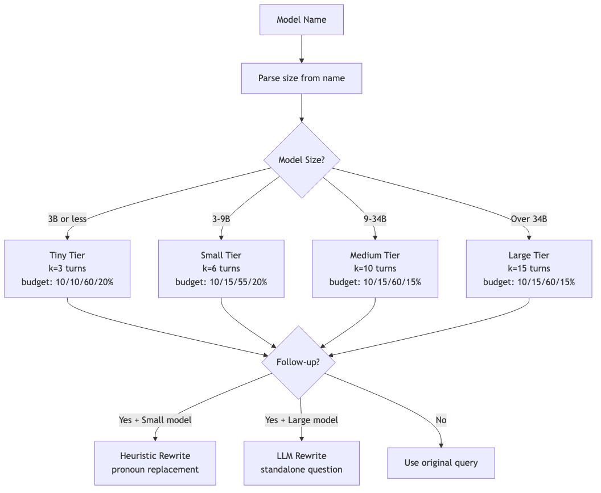
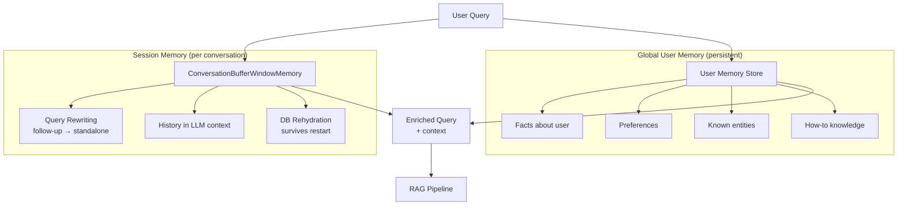
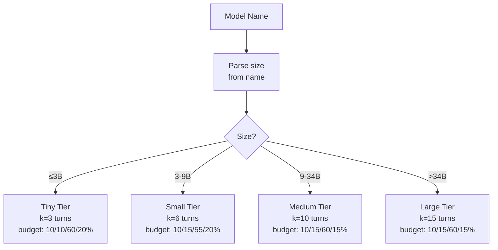
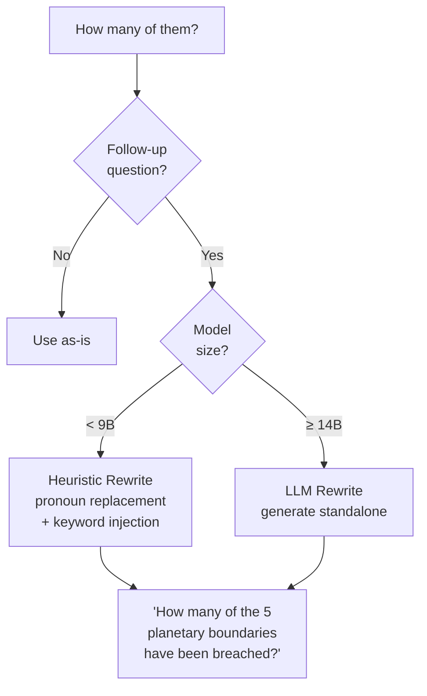
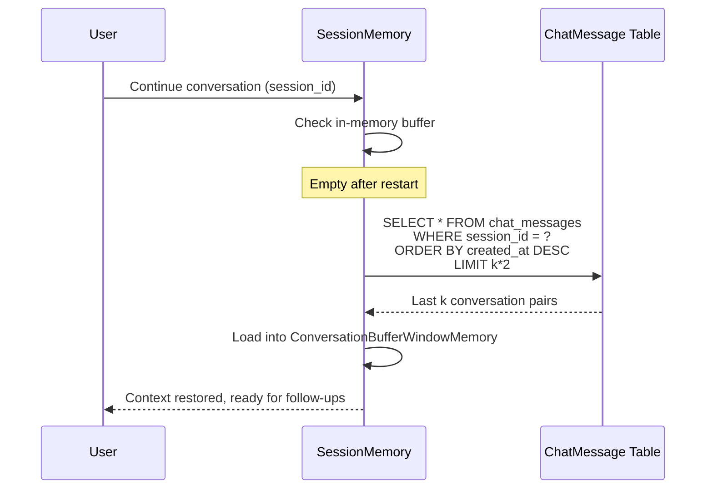
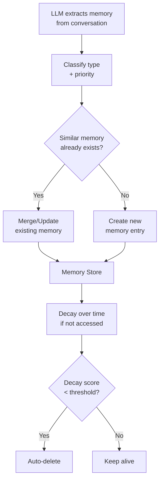

# Memory System

## Overview

The system has two distinct memory subsystems:

1. **Session Memory** — per-conversation history for follow-up questions
2. **Global User Memory** — persistent facts/preferences that span conversations

## Session Memory

**File:** `backend/services/session_memory.py`

### Memory Tiers by Model Size

### Query Rewriting

**Why heuristic for small models?** 3B models can't do meta-tasks — they answer the rewrite prompt as if it were a question instead of rewriting.

### DB Rehydration

After a backend restart, conversation history is restored from the database:

## Global User Memory

**File:** `backend/services/mem0_memory.py`, `backend/api/routes/memory.py`

### Memory Types

| Type | Example | Priority |
|------|---------|----------|
| `fact` | "User works at ACME Corp" | high |
| `preference` | "Prefers concise answers" | medium |
| `context` | "Working on Q4 report" | low |
| `procedure` | "Use pytest for testing" | medium |
| `entity` | "John = team lead" | medium |
| `relationship` | "Reports to Jane" | low |

### Memory Lifecycle

### Memory API Endpoints

| Method | Endpoint | Description |
|--------|----------|-------------|
| GET | `/api/v1/memory` | List all memories (paginated, filterable) |
| GET | `/api/v1/memory/stats` | Memory statistics |
| GET | `/api/v1/memory/export` | Export all memories as JSON |
| GET | `/api/v1/memory/{id}` | Get single memory |
| PATCH | `/api/v1/memory/{id}` | Update content or priority |
| DELETE | `/api/v1/memory/{id}` | Delete single memory |
| DELETE | `/api/v1/memory?confirm=true` | Clear all memories |

### Frontend Memory Page

Located at Dashboard > Memory, provides:
- Searchable, filterable list of all memories
- Type and priority badges
- Edit and delete actions
- Export to JSON download
- Clear all with confirmation
- Statistics overview (total, by type, by priority)
