# RAG Query Pipeline — End-to-End

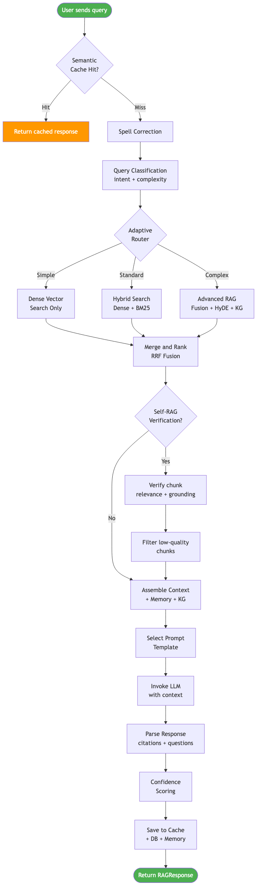

This document traces every step from user query to final answer.

## Pipeline Overview

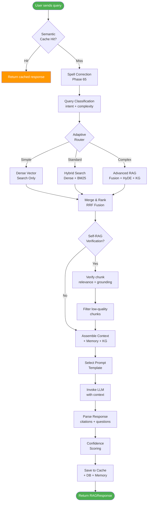

## Step 1: Chat Endpoint

**File:** `backend/api/routes/chat.py` — `create_chat_completion()`

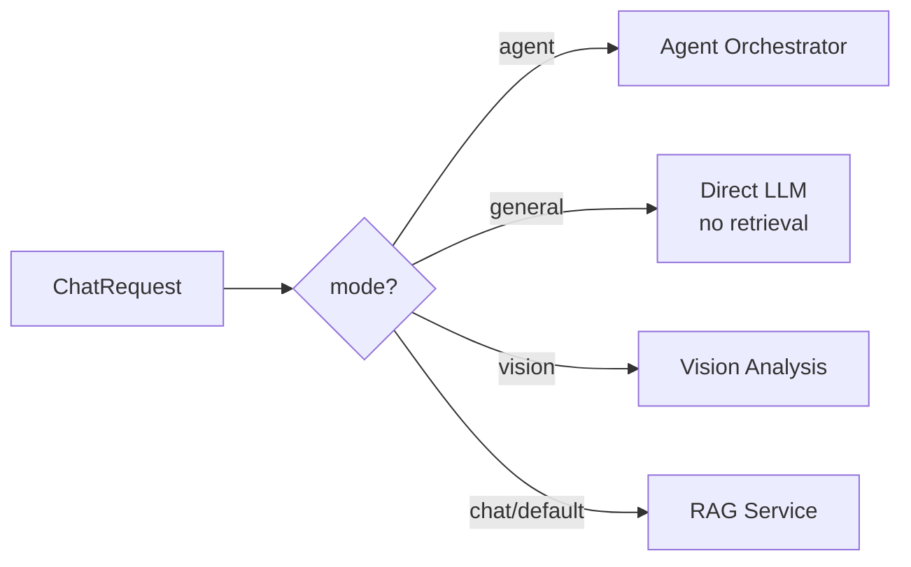

The endpoint receives a `ChatRequest` with:
- `message` — the user's question
- `session_id` — conversation continuity
- `mode` — routing: `chat` (RAG), `general` (no docs), `agent` (multi-step), `vision` (images)
- `collection_filter` / `folder_id` — scope which documents to search
- `intelligence_level` — basic / standard / enhanced / maximum
- `temperature_override` — per-request creativity control
- `enable_cot`, `enable_verification`, `ensemble_voting` — intelligence toggles

## Step 2: Semantic Cache Check

**File:** `backend/services/semantic_cache.py`

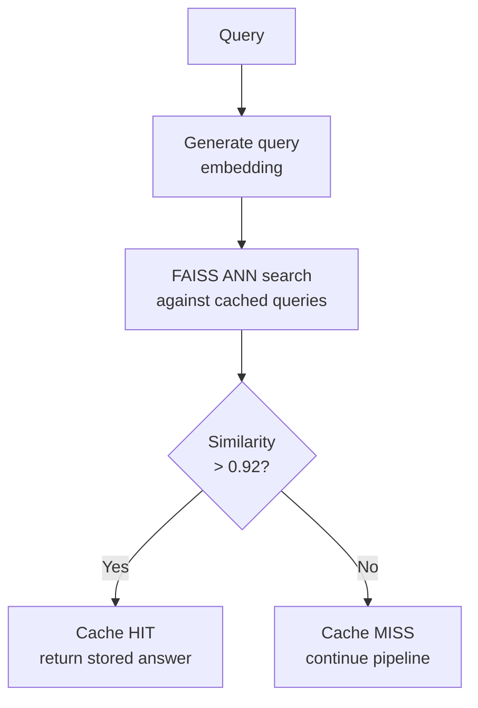

- **Index:** FAISS in-memory with up to 1,000 cached query embeddings
- **Matching:** Dual-threshold — precision (0.95) first, then recall (0.85)
- **TTL:** 300 seconds (5 minutes)
- **Benefit:** Avoids full RAG pipeline for repeated/similar questions

## Step 3: Spell Correction (Phase 65)

**File:** `backend/services/text_preprocessor.py`

Corrects typos in the query before retrieval. Has safety guards:
- **Word overlap check:** If corrected version shares <50% words with original, revert
- **Character similarity:** If <60% similar by edit distance, revert
- **Reason:** Prevents catastrophic corrections (e.g., "of them" → "too the java")

## Step 4: Query Classification

**File:** `backend/services/query_classifier.py`

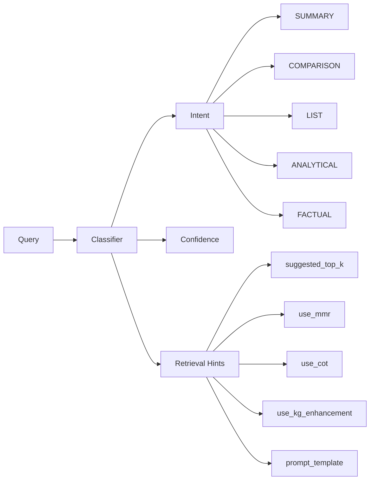

Classification drives downstream behavior:
- **LIST queries** → higher top_k (15), list-specific prompt template
- **COMPARISON queries** → retrieve from multiple docs, comparison template
- **SUMMARY queries** → broader retrieval, summary template
- **FACTUAL queries** → precise retrieval, direct answer template

## Step 5: Adaptive Routing (Phase 66)

**File:** `backend/services/adaptive_router.py`

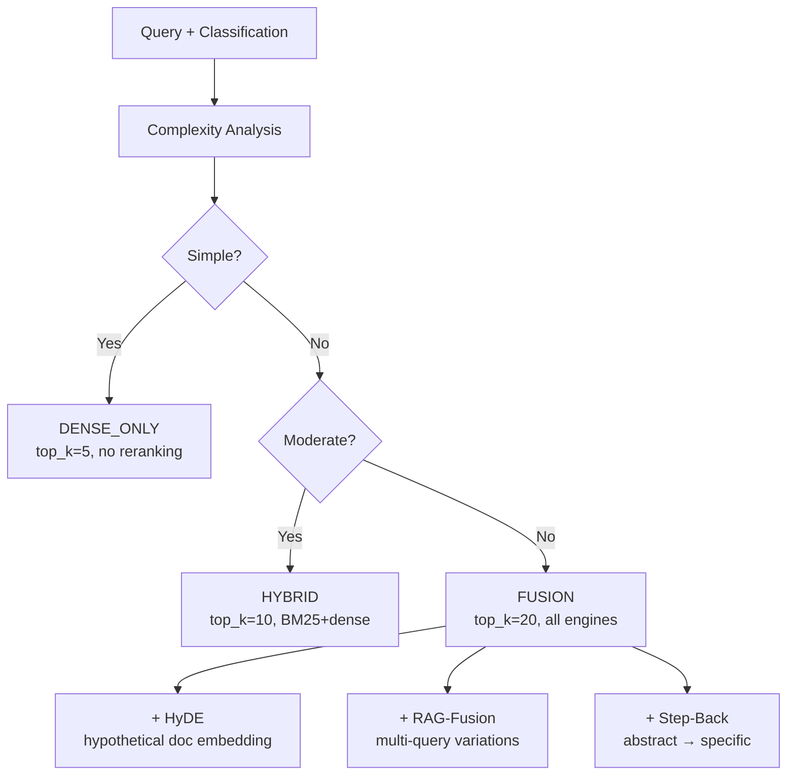

| Strategy | When Used | Latency | Quality |
|----------|-----------|---------|---------|
| `DENSE_ONLY` | Short factual queries | ~50ms | Good |
| `HYBRID` | Standard queries | ~100ms | Better |
| `FUSION` | Complex multi-part queries | ~300ms | Best |
| `TWO_STAGE` | High-precision needs | ~200ms | Very Good |
| `HIERARCHICAL` | Document-spanning queries | ~250ms | Best for long docs |

## Step 6: Document Retrieval

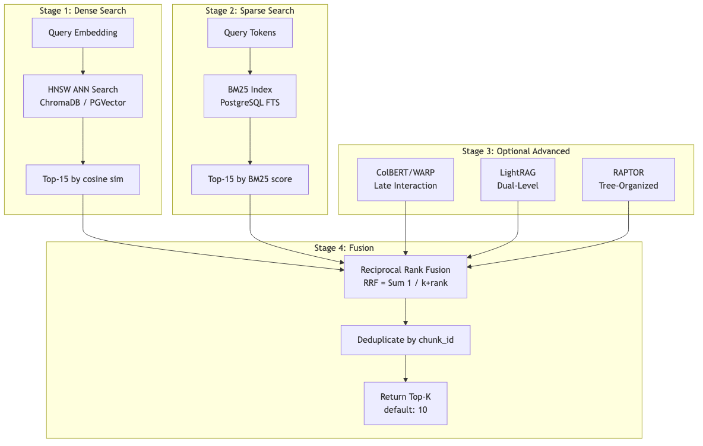

**File:** `backend/services/hybrid_retriever.py`

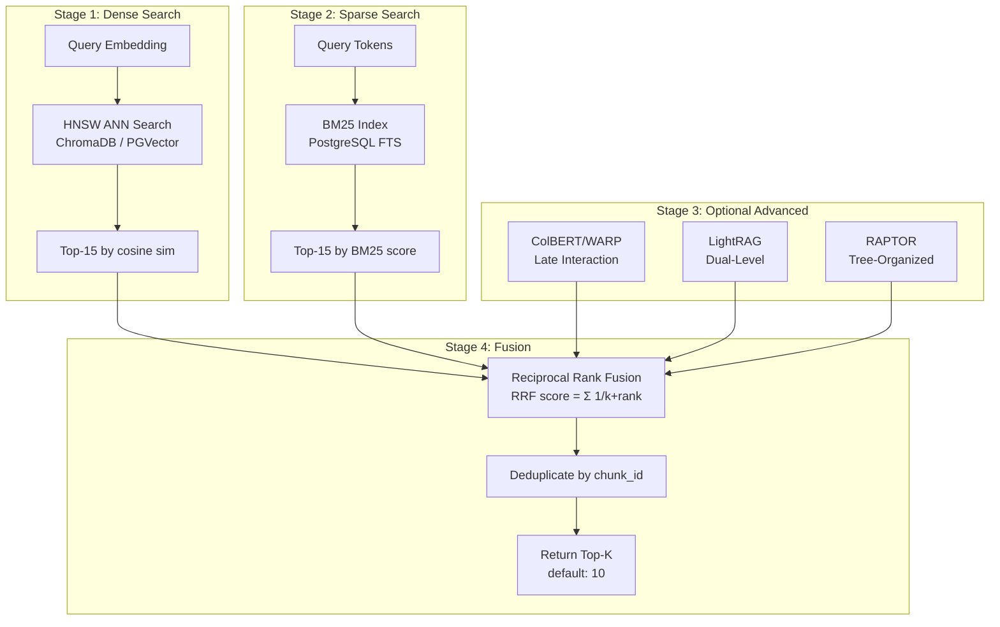

### RRF Fusion Formula

```
RRF(document) = Σ  1 / (k + rank_i(document))
                i∈sources
```

Where `k=30` (dampening). This is position-based, not score-based, making it robust across different score distributions.

### Query Expansion (if enabled)

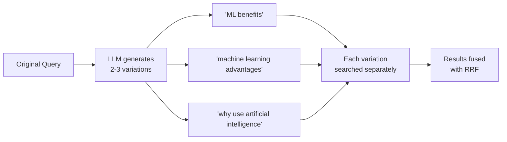

### HyDE (Hypothetical Document Embeddings)

For abstract queries (< 5 words), the LLM generates a hypothetical document that would answer the query. The embedding of this synthetic document is used as an additional search vector.

## Step 7: Post-Retrieval Processing

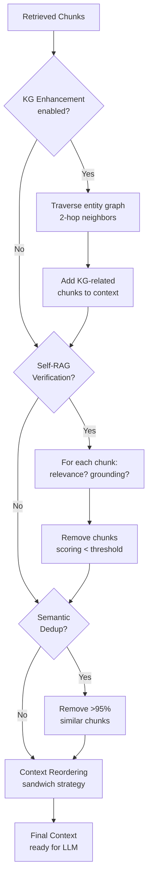

### Content-Type Penalties

Certain chunk types are penalized during scoring:
- **Glossary/reference:** -30% score (usually not directly answering questions)
- **Table of contents:** -50% score
- **Image credits:** -40% score
- **Hypothetical question chunks:** filtered at vector store level

## Step 8: Conversation Memory

**File:** `backend/services/session_memory.py`

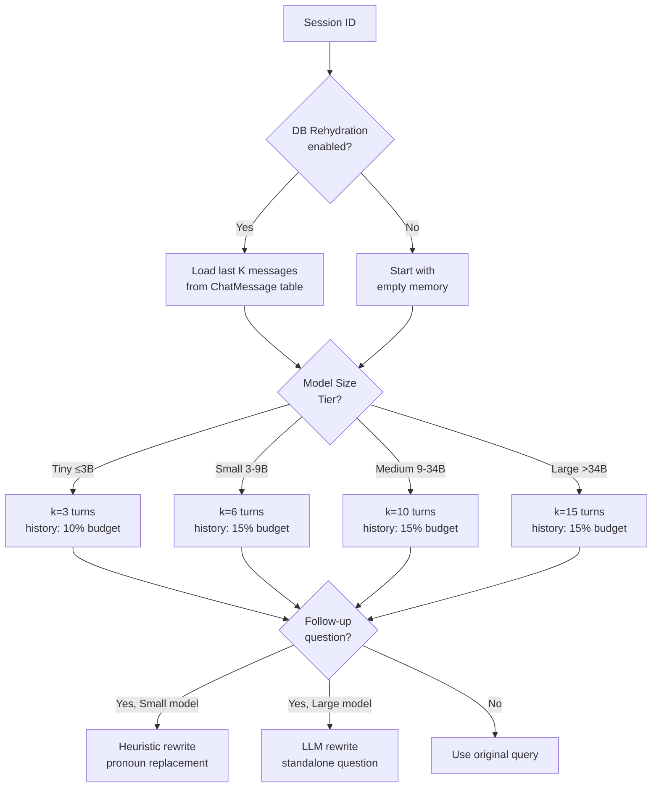

### Token Budget Allocation

```
┌─────────────────────────────────────────────────┐
│              Context Window (e.g., 8000 tokens)  │
├──────────┬──────────┬──────────────┬────────────┤
│ System   │ History  │ Chunks       │ Generation │
│ 10-15%   │ 10-15%  │ 55-60%       │ 15-20%     │
│ ~1000    │ ~1000   │ ~4500        │ ~1500      │
└──────────┴──────────┴──────────────┴────────────┘
```

## Step 9: LLM Invocation

**File:** `backend/services/llm.py`

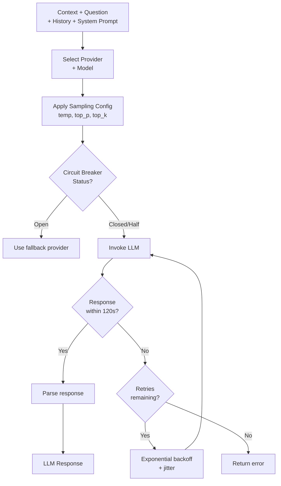

### Model-Specific Configurations

| Model | Context Window | Temperature | top_p | Notes |
|-------|---------------|-------------|-------|-------|
| llama3.2:latest | 8,000 | 0.3 | 0.7 | Quote-first prompting |
| llama3.1:latest | 8,000 | 0.5 | 0.8 | Standard |
| mistral:latest | 8,000 | 0.5 | 0.8 | Standard |
| qwen2.5:latest | 32,000 | 0.7 | 0.95 | Higher top_p for stability |
| gpt-4 | 128,000 | 0.7 | 0.9 | Full context |
| claude-3-opus | 200,000 | 0.7 | 0.9 | Largest context |

### Prompt Template Selection

Based on query classification:

| Intent | Template | Key Instructions |
|--------|----------|-----------------|
| FACTUAL | `RAG_PROMPT_TEMPLATE` | "Direct answer first, cite [Source N]" |
| SUMMARY | `SUMMARY_TEMPLATE` | "2-3 sentence summary, then key points" |
| COMPARISON | `COMPARISON_TEMPLATE` | "Structured comparison with citations" |
| LIST | `LIST_TEMPLATE` | "Enumerate ALL items, cite each" |
| ANALYTICAL | `ANALYTICAL_TEMPLATE` | "Evidence → analysis → conclusion" |

## Step 10: Response Assembly

```mermaid
flowchart TD
    RAW[Raw LLM Output] --> STRIP[Strip preambles<br/>"Sure, I'll help:"]

    STRIP --> EXTRACT_Q[Extract suggested<br/>questions from<br/>SUGGESTED_QUESTIONS: q1|q2|q3]

    EXTRACT_Q --> NORMALIZE[Normalize citations<br/>[source 1] → [Source 1]]

    NORMALIZE --> CONFIDENCE[Calculate confidence<br/>relevance × grounding]

    CONFIDENCE --> SUFFICIENCY[Context sufficiency<br/>check: coverage score]

    SUFFICIENCY --> SOURCES[Assemble source<br/>citations with snippets]

    SOURCES --> CACHE_SAVE[Save to semantic<br/>cache + response cache]

    CACHE_SAVE --> DB_SAVE[Persist to DB<br/>ChatMessage table]

    DB_SAVE --> MEM_SAVE[Update session<br/>memory buffer]

    MEM_SAVE --> RESPONSE[Return RAGResponse<br/>content + sources +<br/>confidence + suggestions]
```

### RAGResponse Structure

```json
{
  "content": "The answer text with [Source 1] citations...",
  "sources": [
    {
      "document_id": "uuid",
      "document_name": "report.pdf",
      "chunk_id": "uuid",
      "page_number": 5,
      "snippet": "First 200 chars of relevant chunk...",
      "relevance_score": 0.85,
      "similarity_score": 0.72
    }
  ],
  "confidence_score": 0.82,
  "confidence_level": "high",
  "suggested_questions": ["Follow-up 1?", "Follow-up 2?"],
  "context_sufficiency": {
    "is_sufficient": true,
    "coverage_score": 0.88,
    "has_conflicts": false,
    "missing_aspects": []
  }
}
```

## Intelligence Levels

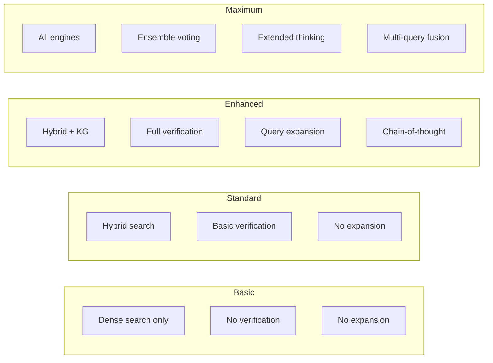

| Level | Features Enabled | Latency | Best For |
|-------|-----------------|---------|----------|
| Basic | Dense search, direct answer | ~1s | Quick lookups |
| Standard | Hybrid search, basic verify | ~2s | General Q&A |
| Enhanced | + KG, expansion, CoT, verify | ~4s | Complex research |
| Maximum | + Ensemble, extended thinking | ~8s | Critical decisions |

## Configuration Reference

All settings are stored in the database and can be changed at runtime via Admin > Settings.

### Retrieval Settings

| Setting Key | Default | Description |
|-------------|---------|-------------|
| `rag.top_k` | 10 | Chunks to retrieve per query |
| `rag.similarity_threshold` | 0.40 | Minimum cosine similarity |
| `rag.use_hybrid_search` | true | Enable BM25 + dense fusion |
| `rag.query_expansion_enabled` | false | Expand queries with LLM |
| `rag.hyde_enabled` | false | Hypothetical document embeddings |
| `rag.knowledge_graph_enabled` | false | KG-enhanced retrieval |
| `rag.verification_enabled` | true | Self-RAG chunk verification |
| `rag.rrf_k` | 30 | RRF dampening parameter |

### Cache Settings

| Setting Key | Default | Description |
|-------------|---------|-------------|
| `cache.enabled` | true | Enable semantic cache |
| `cache.max_entries` | 1000 | Max cached queries |
| `cache.default_ttl_seconds` | 300 | Cache entry lifetime |
| `cache.threshold_mode` | adaptive | precision/recall/adaptive |

### Conversation Settings

| Setting Key | Default | Description |
|-------------|---------|-------------|
| `conversation.query_rewriting_enabled` | true | Rewrite follow-ups |
| `conversation.db_rehydration_enabled` | true | Restore history from DB |
| `conversation.max_history_turns` | 15 | Max turns to keep |
