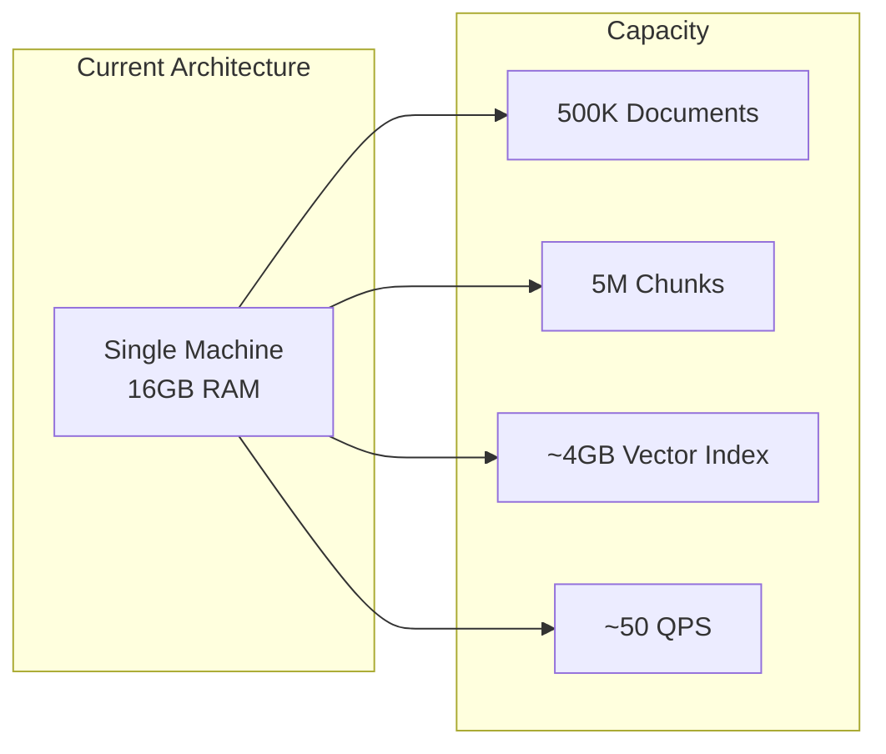
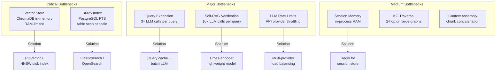
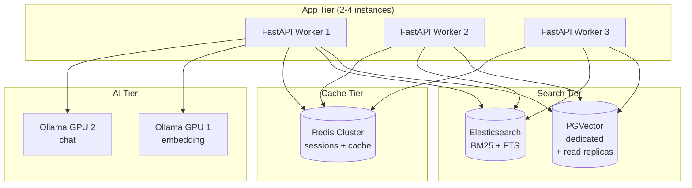
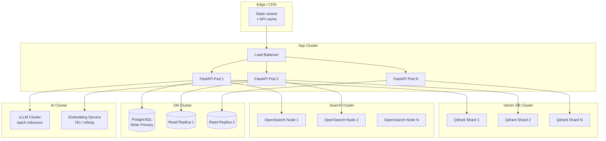
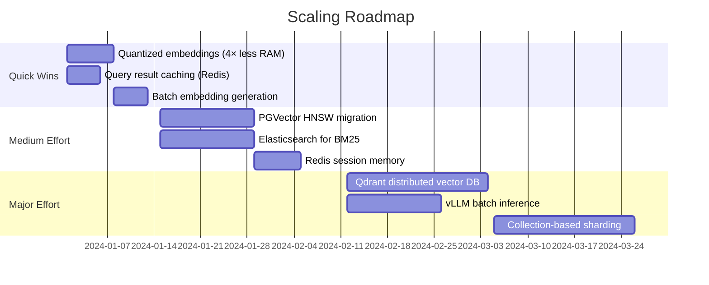

# Scalability Analysis

## Can This System Handle Millions of Documents?

**Short answer:** The current single-machine architecture handles up to ~500K documents well. Millions require infrastructure changes (mostly swapping storage backends), not major code rewrites.

## Current Capacity Estimates



| Metric | Current Limit | Bottleneck |
|--------|--------------|------------|
| Documents | ~500K | Vector index RAM |
| Chunks | ~5M | ChromaDB HNSW memory |
| Concurrent queries | ~50 QPS | Single FastAPI process |
| Query latency (p50) | ~2s | LLM inference |
| Query latency (p99) | ~8s | Complex RAG + verification |
| Index build time | ~2hr/100K docs | Embedding generation |

## Bottleneck Analysis



## Scaling Tiers

### Tier 1: Up to 500K Documents (Current)

```
Single machine, 16-32GB RAM
├── PostgreSQL + pgvector
├── ChromaDB (in-process)
├── Ollama (local GPU)
├── Redis (optional, in-memory fallback)
└── FastAPI (single process, multiple workers)
```

**No changes needed.** This is the current architecture.

### Tier 2: 500K - 5M Documents



**Required changes:**
1. **Replace ChromaDB with PGVector HNSW** — disk-based index, shared across workers
2. **Add Elasticsearch** for BM25 — distributed full-text search
3. **Redis cluster** for session memory and semantic cache
4. **Multiple FastAPI workers** behind load balancer
5. **Separate embedding GPU** from chat GPU

**Code changes:** Minimal — `vectorstore_local.py` already abstracts the vector store interface. Add Elasticsearch adapter for `hybrid_retriever.py`.

### Tier 3: 5M - 50M Documents



**Required changes:**
1. **Qdrant or Weaviate** — distributed vector DB with automatic sharding
2. **OpenSearch serverless** — managed full-text search
3. **vLLM** — batched LLM inference (10-50× throughput)
4. **Text Embedding Inference (TEI)** — dedicated embedding service
5. **Collection-based sharding** — partition by document collection
6. **Read replicas** for PostgreSQL

### Tier 4: 50M+ Documents (Enterprise)

Same as Tier 3 plus:
- **Multi-region deployment** with geo-routing
- **Tiered storage** — hot (SSD) / warm (HDD) / cold (S3) vectors
- **Async indexing pipeline** with Celery + RabbitMQ
- **Approximate pre-filtering** before ANN search
- **Quantized vectors** (int8/binary) for 4-8× memory reduction

## Performance Optimization Roadmap



## Cost Estimates (Cloud Deployment)

| Scale | Infrastructure | Monthly Cost (est.) |
|-------|---------------|-------------------|
| 100K docs | 1× 32GB server + 1× GPU | $200-400 |
| 500K docs | 2× 32GB + managed PG + 1× GPU | $500-1,000 |
| 2M docs | 4× servers + PG cluster + 2× GPU | $2,000-4,000 |
| 10M docs | K8s cluster + Qdrant + ES + vLLM | $8,000-15,000 |
| 50M docs | Multi-region + enterprise DBs | $30,000-60,000 |

## What Works Well at Scale Already

The current architecture has several scale-friendly design decisions:

1. **Async everywhere** — SQLAlchemy async, async LLM calls, no blocking I/O
2. **Batch settings loading** — All 30+ settings in one DB query, cached
3. **Semantic caching** — Avoids full pipeline for repeated queries
4. **Adaptive routing** — Simple queries skip expensive operations
5. **Token budgeting** — Dynamic allocation prevents context overflow
6. **Circuit breaker** — Graceful degradation when LLM providers fail
7. **Content-type penalties** — Skip low-value chunks early in pipeline
8. **Lazy initialization** — Services created on first use, not startup
9. **Abstract interfaces** — VectorStore, EmbeddingProvider, LLMProvider all pluggable
