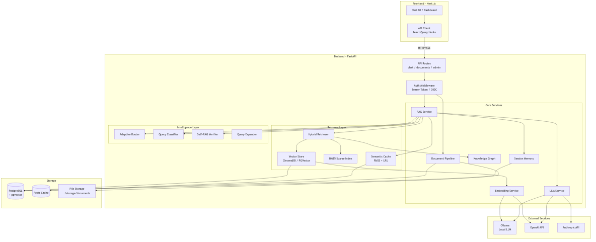
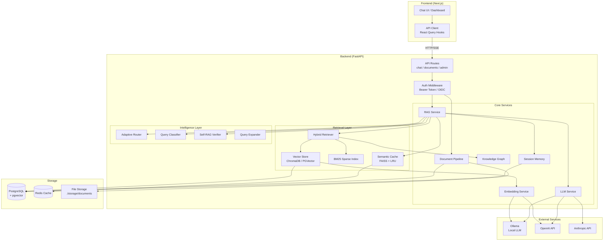
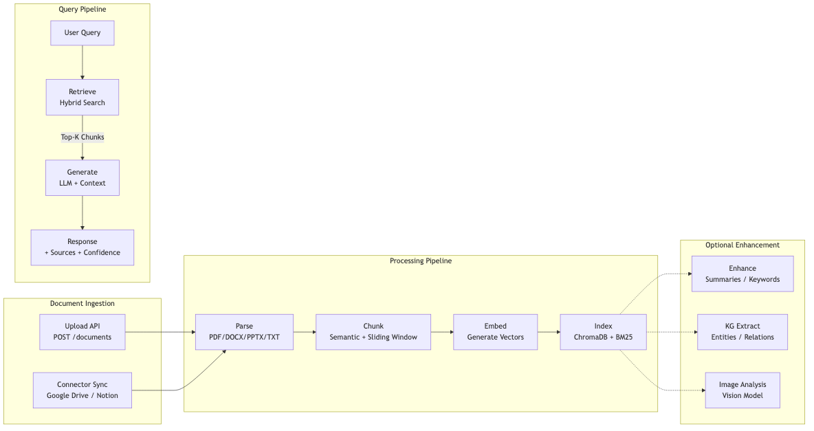
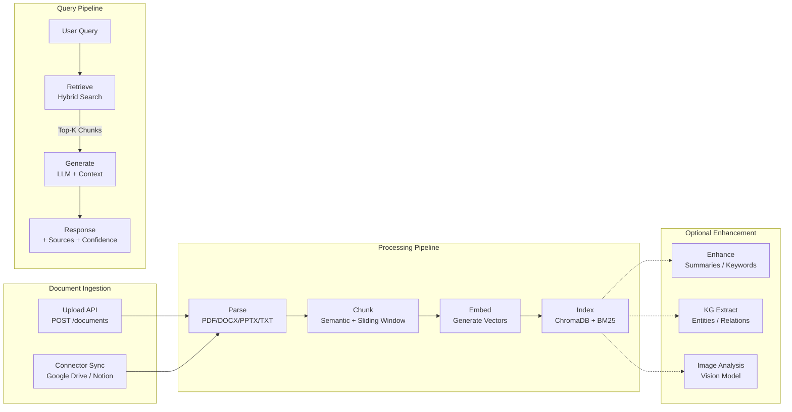
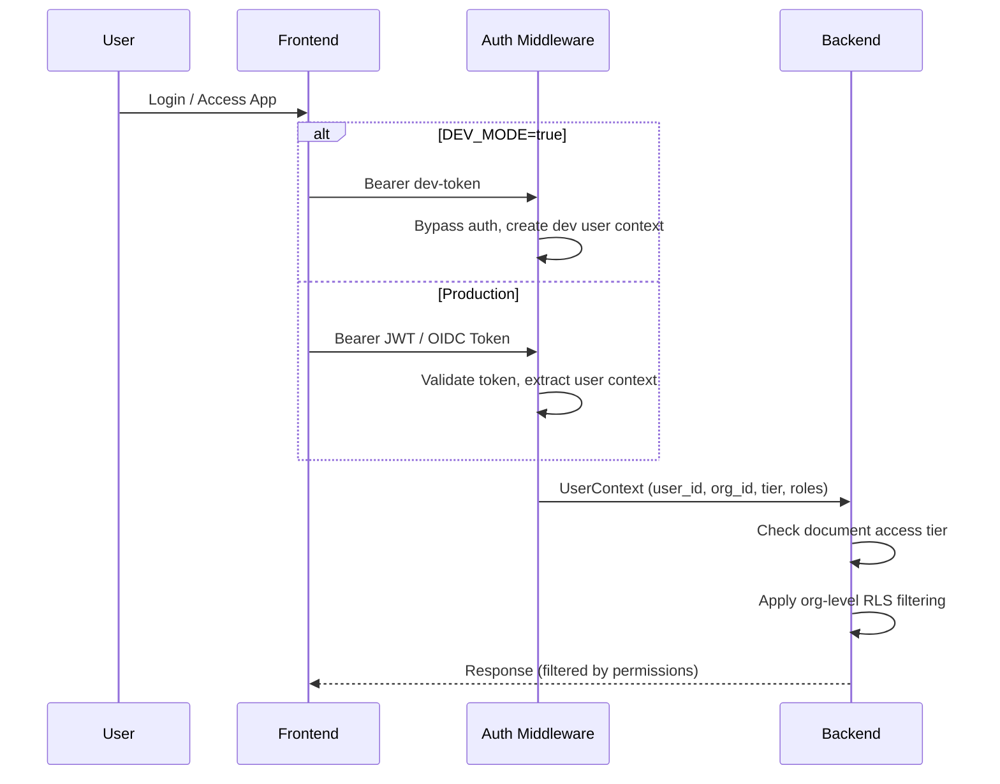
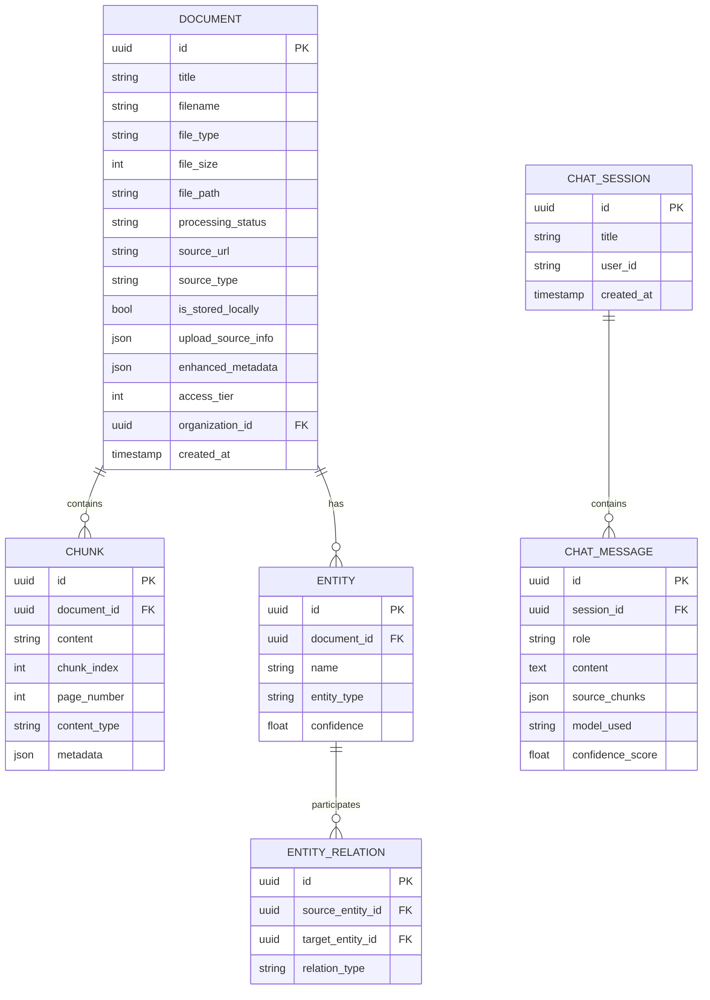
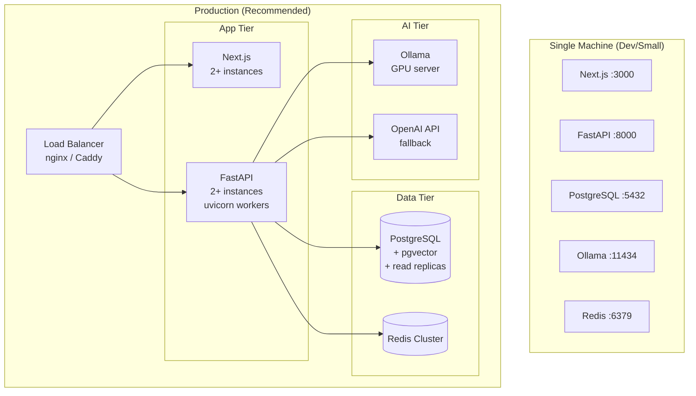

# System Architecture

## High-Level Overview

## Component Map

| Component | File | Purpose |
|-----------|------|---------|
| **API Routes** | `backend/api/routes/chat.py` | Chat completions, streaming |
| | `backend/api/routes/documents.py` | CRUD, upload, preview, download |
| | `backend/api/routes/admin.py` | Settings, storage stats, enhancement |
| | `backend/api/routes/connectors.py` | External source connectors |
| | `backend/api/routes/memory.py` | User memory management |
| **RAG Service** | `backend/services/rag.py` | Orchestrates the full RAG pipeline |
| **LLM Service** | `backend/services/llm.py` | Model management, invocation, circuit breaker |
| **Embeddings** | `backend/services/embeddings.py` | Text-to-vector encoding |
| **Hybrid Retriever** | `backend/services/hybrid_retriever.py` | Dense + sparse + ColBERT fusion |
| **Vector Store** | `backend/services/vectorstore_local.py` | ChromaDB/PGVector CRUD |
| **Session Memory** | `backend/services/session_memory.py` | Conversation history + query rewriting |
| **Semantic Cache** | `backend/services/semantic_cache.py` | FAISS-based query dedup |
| **Text Preprocessor** | `backend/services/text_preprocessor.py` | Spell correction, normalization |
| **Document Pipeline** | `backend/services/pipeline.py` | Parse → chunk → embed → index |
| **Knowledge Graph** | `backend/services/knowledge_graph.py` | Entity/relation extraction |
| **Settings** | `backend/services/settings.py` | Runtime config from DB |
| **Connector Scheduler** | `backend/services/connectors/scheduler.py` | External source sync |

## Data Flow Diagram

## Authentication Flow

## Database Schema (Core Tables)

## Deployment Architecture

